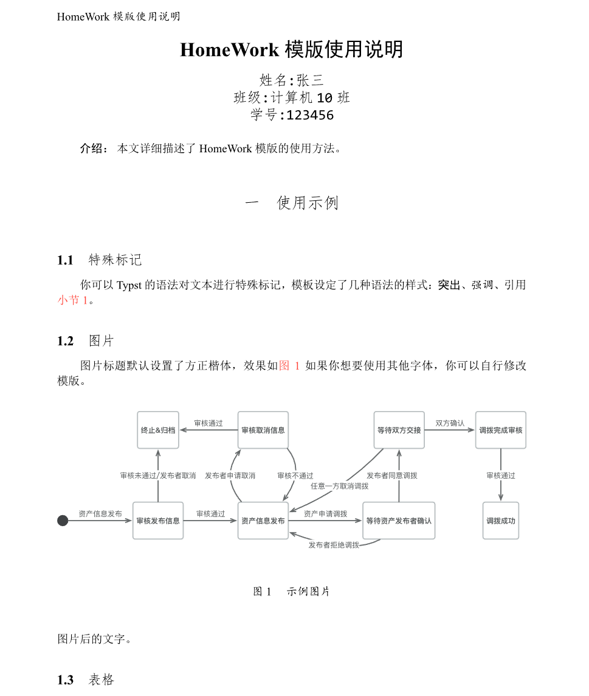

# Typst 作业模板（Homework Template）

## 简介
- 本模板基于 Typst，用于快速编写课程作业/练习册，包含作者信息、摘要、题目/解答块、图表和参考文献样式。
- 本项目基于[SimplePaper](https://github.com/jinhao-huang/SimplePaper)进行二次开发。

## 前提
- 已安装 Typst。
- 请在模板中确认并使用系统已安装的字体，模板使用如下字体
```t
  let zh_shusong = ("SimSun", "NSimSun")
  let zh_xiaobiansong = ("FangSong", "FangSong")       
  let zh_kai = ("KaiTi", "STKaiti")
  let zh_hei = ("SimHei", "Microsoft YaHei")
  let zh_fangsong = ("FangSong", "FangSong")          
  let en_sans_serif = "Arial"
  let en_serif = "Times New Roman"
  let en_typewriter = "Consolas"
  let en_code = "Consolas"
```

## 使用步骤
1. 在作业项目目录中，创建或编辑 example.typ（示例见下）。确保同目录包含 homework.typ（模板）和其它资源（图片、ref.bib 等）。
2. 在文档顶部导入模板并填写元数据：
   - title, authors, abstract, keywords 等。
3. 在正文中使用 #problem(...) 与 #solution(...) 宏编写题目和解答（模板已定义）。
4. 编译：
   - typst 版本带 compile 子命令：
     typst compile example.typ example.pdf
   - 或使用完整路径：
     D:\typst\typst.exe compile example.typ example.pdf

## 资源
- 图片放在 ./photo/ 目录下
- 参考文献文件为 ref.bib，可用 #bibliography("ref.bib") 引入


## 示例（见 example.typ）
